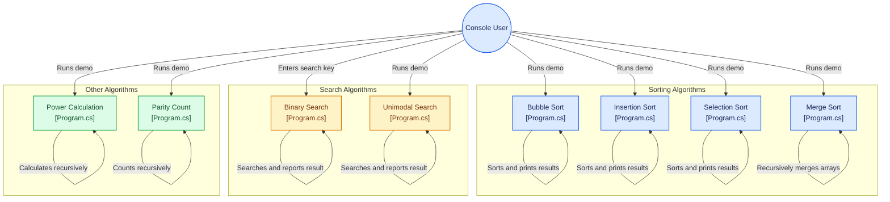

# Algorithms_Tasks
## Tasks of Analaysis and Design of Algorithms Course
### Application on ( Sorting Algorithms - Divide & Conquer technique ... and other ralated)

## Algorithms Workflow

```mermaid id="r5n8cx"
flowchart TD
    subgraph group_sorting["Sorting Algorithms"]
        node_bubble["Bubble Sort<br/>[Program.cs]"]
        node_insertion["Insertion Sort<br/>[Program.cs]"]
        node_selection["Selection Sort<br/>[Program.cs]"]
        node_merge["Merge Sort<br/>[Program.cs]"]
    end

    subgraph group_search["Search Algorithms"]
        node_binary["Binary Search<br/>[Program.cs]"]
        node_unimodal["Unimodal Search<br/>[Program.cs]"]
    end

    subgraph group_other["Other Algorithms"]
        node_power["Power Calculation<br/>[Program.cs]"]
        node_parity["Parity Count<br/>[Program.cs]"]
    end

    node_user(("Console User"))

    node_user -->|"Runs demo"| node_bubble
    node_user -->|"Runs demo"| node_insertion
    node_user -->|"Runs demo"| node_selection
    node_user -->|"Runs demo"| node_merge
    node_user -->|"Enters search key"| node_binary
    node_user -->|"Runs demo"| node_unimodal
    node_user -->|"Runs demo"| node_power
    node_user -->|"Runs demo"| node_parity

    node_bubble -->|"Sorts and prints results"| node_bubble
    node_insertion -->|"Sorts and prints results"| node_insertion
    node_selection -->|"Sorts and prints results"| node_selection
    node_merge -->|"Recursively merges arrays"| node_merge
    node_binary -->|"Searches and reports result"| node_binary
    node_unimodal -->|"Searches and reports result"| node_unimodal
    node_power -->|"Calculates recursively"| node_power
    node_parity -->|"Counts recursively"| node_parity

    click node_bubble "https://github.com/yassakamille/algorithms_tasks/blob/main/Bubble_sort/Bubble_sort/Program.cs"
    click node_insertion "https://github.com/yassakamille/algorithms_tasks/blob/main/Insertion_Sort/Insertion_Sort/Program.cs"
    click node_selection "https://github.com/yassakamille/algorithms_tasks/blob/main/Selection_sort/Selection_sort/Program.cs"
    click node_merge "https://github.com/yassakamille/algorithms_tasks/blob/main/Merge_sort/Merge_sort/Program.cs"
    click node_binary "https://github.com/yassakamille/algorithms_tasks/blob/main/Binary_Search/Binary_Search/Program.cs"
    click node_unimodal "https://github.com/yassakamille/algorithms_tasks/blob/main/Unimodel/Unimodel/Program.cs"
    click node_power "https://github.com/yassakamille/algorithms_tasks/blob/main/Powering/Powering/Program.cs"
    click node_parity "https://github.com/yassakamille/algorithms_tasks/blob/main/Even_Odd/Even_Odd/Program.cs"

    classDef toneNeutral fill:#f8fafc,stroke:#334155,stroke-width:1.5px,color:#0f172a
    classDef toneBlue fill:#dbeafe,stroke:#2563eb,stroke-width:1.5px,color:#172554
    classDef toneAmber fill:#fef3c7,stroke:#d97706,stroke-width:1.5px,color:#78350f
    classDef toneMint fill:#dcfce7,stroke:#16a34a,stroke-width:1.5px,color:#14532d
    classDef toneRose fill:#ffe4e6,stroke:#e11d48,stroke-width:1.5px,color:#881337
    classDef toneIndigo fill:#e0e7ff,stroke:#4f46e5,stroke-width:1.5px,color:#312e81
    classDef toneTeal fill:#ccfbf1,stroke:#0f766e,stroke-width:1.5px,color:#134e4a

    class node_bubble,node_insertion,node_selection,node_merge,node_user toneBlue
    class node_binary,node_unimodal toneAmber
    class node_power,node_parity toneMint
```

